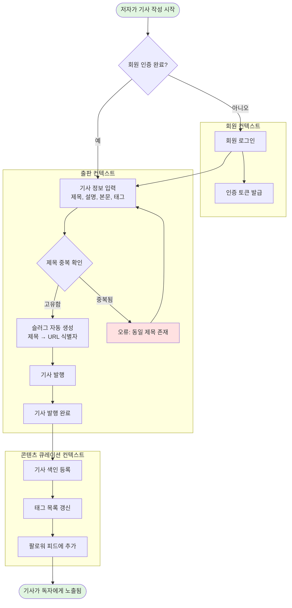
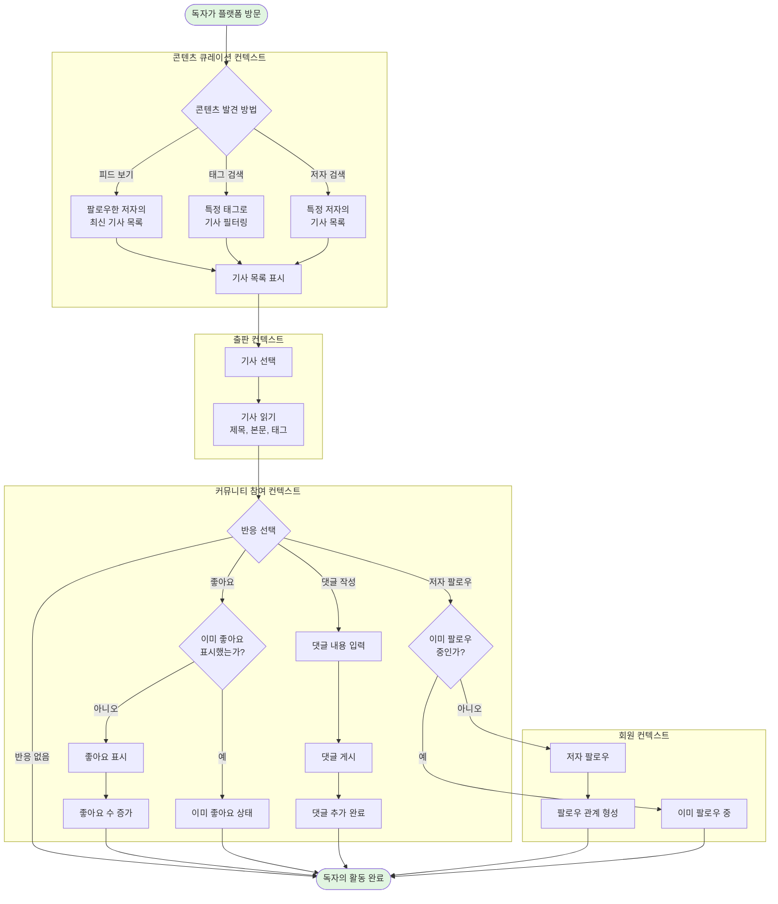
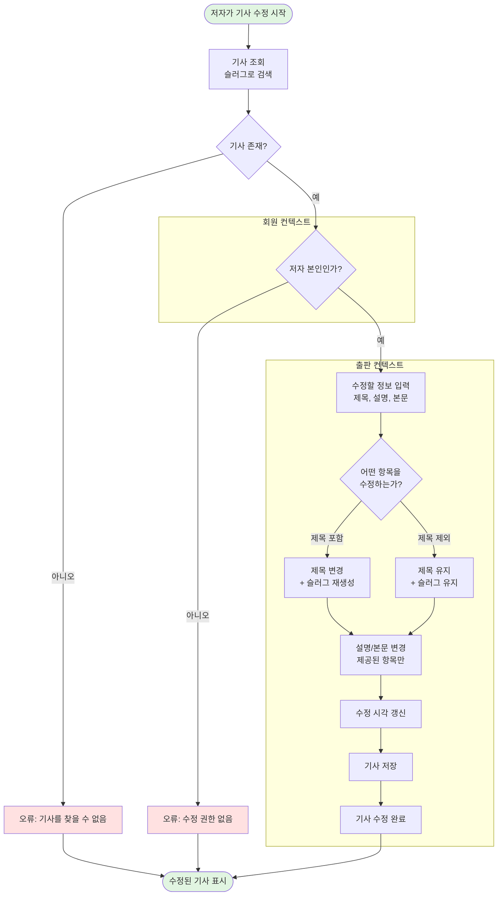
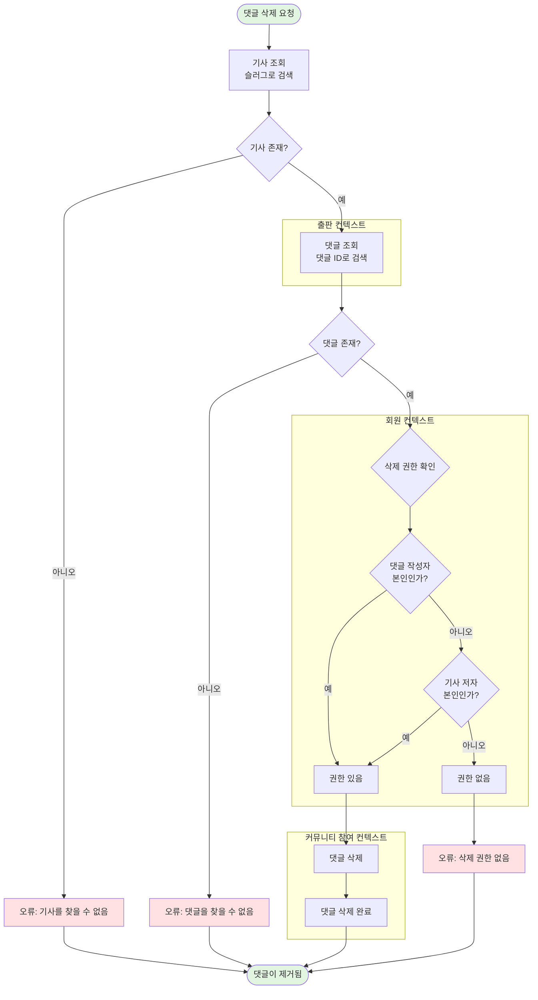
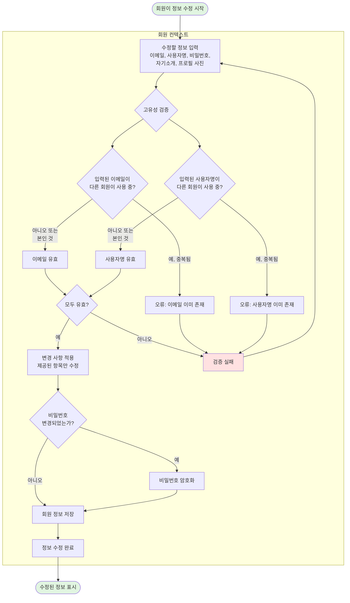
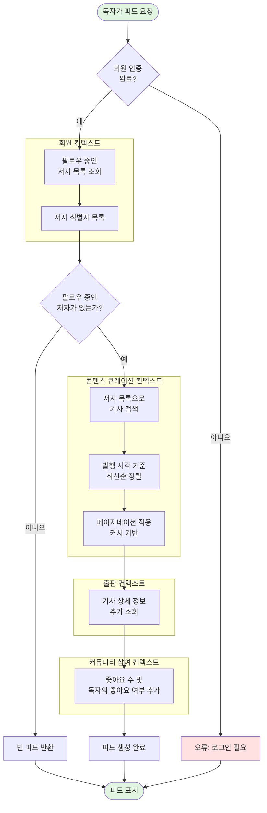
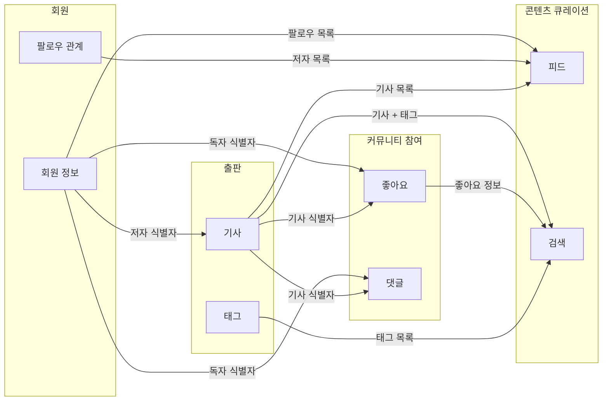

# 비즈니스 프로세스 흐름 시각화

## 개요

이 문서는 RealWorld 플랫폼의 핵심 비즈니스 프로세스를 End-to-End로 시각화합니다. 각 흐름도는 비즈니스 이벤트와 활동 중심으로 구성되어 있으며, Product Owner, 개발자, 비즈니스 분석가, 도메인 전문가가 함께 검토할 수 있도록 유비쿼터스 언어를 사용합니다.

---

## 프로세스 1: 저자의 기사 발행 여정

**비즈니스 목적**: 저자가 자신의 생각을 기사로 작성하여 독자들에게 공유하는 전체 과정

**참여 컨텍스트**: 회원 → 출판 → 콘텐츠 큐레이션

**데이터 흐름**:
- 회원 → 출판: 저자 식별자, 인증 토큰
- 출판 → 큐레이션: 기사 식별자, 태그 목록, 저자 식별자

**주요 결정 지점**:
1. **회원 인증 확인**: 로그인하지 않은 사용자는 기사를 작성할 수 없음
2. **제목 중복 확인**: 동일한 제목의 기사가 이미 존재하는지 검증

**비즈니스 규칙**:
- 슬러그는 제목으로부터 자동 생성됨 (소문자 변환, 특수문자 제거)
- 태그는 중복 없이 저장됨
- 발행 즉시 팔로워의 피드에 노출됨

---

## 프로세스 2: 독자의 기사 소비 및 반응 여정

**비즈니스 목적**: 독자가 관심 있는 기사를 발견하고, 읽고, 반응하는 전체 과정

**참여 컨텍스트**: 콘텐츠 큐레이션 → 커뮤니티 참여 → 회원

**데이터 흐름**:
- 큐레이션 → 출판: 기사 식별자
- 출판 → 커뮤니티 참여: 기사 식별자, 저자 식별자
- 커뮤니티 참여 → 회원: 독자 식별자, 저자 식별자

**주요 결정 지점**:
1. **콘텐츠 발견 방법**: 피드, 태그 검색, 저자 검색 중 선택
2. **좋아요 중복 확인**: 이미 좋아요한 기사인지 확인
3. **팔로우 중복 확인**: 이미 팔로우 중인 저자인지 확인

**비즈니스 규칙**:
- 동일한 기사에 중복 좋아요 불가
- 동일한 저자를 중복 팔로우 불가
- 댓글은 작성 후 수정 불가 (삭제만 가능)

---

## 프로세스 3: 저자의 기사 수정 여정

**비즈니스 목적**: 저자가 발행한 기사의 내용을 수정하는 과정

**참여 컨텍스트**: 회원 → 출판

**데이터 흐름**:
- 회원 → 출판: 저자 식별자, 인증 토큰
- 출판 내부: 기사 식별자, 수정할 필드 목록

**주요 결정 지점**:
1. **기사 존재 확인**: 슬러그로 기사를 찾을 수 있는가?
2. **소유권 확인**: 요청자가 기사 저자 본인인가?
3. **수정 항목 결정**: 제목을 수정하는가? (슬러그 재생성 여부 결정)

**비즈니스 규칙** (결정 테이블 3-2 참조):
- 제공된 항목만 수정되고 나머지는 기존 값 유지
- 제목을 수정하면 슬러그도 자동으로 재생성됨
- 어떤 항목이든 수정되면 수정 시각이 현재 시각으로 갱신됨

**잠재적 이슈**:
- 제목 변경 시 슬러그(URL)가 변경되어 기존 링크가 깨질 수 있음

---

## 프로세스 4: 커뮤니티 관리 - 댓글 삭제 여정

**비즈니스 목적**: 부적절한 댓글을 삭제하여 건전한 커뮤니티를 유지하는 과정

**참여 컨텍스트**: 회원 → 출판 → 커뮤니티 참여

**데이터 흐름**:
- 회원 → 출판: 요청자 식별자, 기사 슬러그
- 출판 → 커뮤니티 참여: 기사 식별자, 댓글 식별자
- 커뮤니티 참여 → 회원: 댓글 작성자 식별자, 기사 저자 식별자

**주요 결정 지점**:
1. **기사 존재 확인**: 슬러그로 기사를 찾을 수 있는가?
2. **댓글 존재 확인**: 해당 기사에 댓글이 존재하는가?
3. **삭제 권한 확인** (결정 테이블 2-2 참조):
   - 댓글 작성자 본인인가? → 권한 있음
   - 기사 저자 본인인가? → 권한 있음
   - 둘 다 아니면 → 권한 없음

**비즈니스 규칙**:
- 댓글 작성자는 자신의 댓글을 삭제할 수 있음
- 기사 저자는 자신의 기사에 달린 모든 댓글을 삭제할 수 있음 (커뮤니티 관리 권한)
- 그 외의 회원은 댓글을 삭제할 수 없음

**발견된 이슈**:
- 플랫폼 관리자가 부적절한 댓글을 삭제할 수 있는 권한이 없음
- 신고 기능이 없어 부적절한 댓글을 발견해도 대응 방법이 제한적

---

## 프로세스 5: 회원 정보 수정 여정

**비즈니스 목적**: 회원이 자신의 프로필 정보를 업데이트하는 과정

**참여 컨텍스트**: 회원

**데이터 흐름**:
- 회원 내부: 회원 식별자, 수정할 필드 목록, 검증 결과

**주요 결정 지점**:
1. **이메일 고유성 확인** (결정 테이블 1 참조):
   - 다른 회원이 사용 중인가? → 오류
   - 본인의 기존 이메일인가? → 허용
   - 사용 중이지 않은가? → 허용
2. **사용자명 고유성 확인**:
   - 다른 회원이 사용 중인가? → 오류
   - 본인의 기존 사용자명인가? → 허용
   - 사용 중이지 않은가? → 허용
3. **비밀번호 변경 여부**: 비밀번호가 제공되었는가? → 암호화 필요

**비즈니스 규칙** (결정 테이블 1, 3-1 참조):
- 이메일과 사용자명은 플랫폼 전체에서 유일해야 함
- 자신의 기존 값으로 재설정하는 것은 허용됨
- 제공된 항목만 수정되고 나머지는 기존 값 유지
- 비밀번호는 암호화되어 저장됨

---

## 프로세스 6: 개인화된 피드 생성

**비즈니스 목적**: 독자가 팔로우한 저자들의 최신 기사를 시간순으로 제공하는 과정

**참여 컨텍스트**: 회원 → 콘텐츠 큐레이션 → 출판

**데이터 흐름**:
- 회원 → 큐레이션: 독자 식별자, 팔로우 중인 저자 목록
- 큐레이션 → 출판: 기사 식별자 목록
- 출판 → 커뮤니티 참여: 기사 식별자 목록
- 커뮤니티 참여 → 독자: 기사 목록 + 좋아요 정보

**주요 결정 지점**:
1. **회원 인증 확인**: 로그인한 회원만 개인화된 피드를 볼 수 있음
2. **팔로우 여부 확인**: 팔로우 중인 저자가 없으면 빈 피드 반환

**비즈니스 규칙**:
- 피드는 팔로우한 저자들의 기사만 포함
- 최신 기사가 먼저 표시됨 (발행 시각 역순)
- 커서 기반 페이지네이션으로 무한 스크롤 지원
- 각 기사에 좋아요 수와 독자의 좋아요 여부가 표시됨

---

## 컨텍스트 간 상호작용 요약

### 주요 데이터 흐름

### 비즈니스 이벤트 흐름

| 이벤트 | 발생 컨텍스트 | 영향받는 컨텍스트 | 데이터 전달 |
|--------|-------------|-----------------|-----------|
| 회원 가입 완료 | 회원 | - | 회원 식별자 |
| 기사 발행 완료 | 출판 | 콘텐츠 큐레이션 | 기사 식별자, 태그 목록, 저자 식별자 |
| 좋아요 표시 | 커뮤니티 참여 | 출판 (좋아요 수 증가) | 기사 식별자, 독자 식별자 |
| 댓글 작성 | 커뮤니티 참여 | 출판 (댓글 수 증가) | 기사 식별자, 댓글 내용, 독자 식별자 |
| 팔로우 형성 | 회원 | 콘텐츠 큐레이션 (피드 구성 변경) | 독자 식별자, 저자 식별자 |

---

## 발견된 비즈니스 기회 및 개선 사항

### 1. 커뮤니티 관리 강화
**현재 상태**: 기사 저자만 댓글을 삭제할 수 있음
**개선 기회**:
- 플랫폼 관리자 역할 추가
- 신고 기능 추가 (부적절한 콘텐츠 신고)
- 회원 정지/차단 기능

### 2. 콘텐츠 버전 관리
**현재 상태**: 기사 수정 시 이전 버전이 사라짐
**개선 기회**:
- 기사 수정 이력 저장
- 이전 버전으로 되돌리기 기능
- 수정 내역 표시

### 3. 슬러그 안정성
**현재 상태**: 제목 변경 시 슬러그(URL)가 변경됨
**개선 기회**:
- 슬러그를 불변으로 유지
- 또는 이전 슬러그로의 리다이렉션 지원

### 4. 알림 시스템
**현재 상태**: 알림 기능 없음
**개선 기회**:
- 새 댓글 알림
- 새 팔로워 알림
- 좋아요 알림

### 5. 검색 고도화
**현재 상태**: 태그, 저자, 좋아요 기반 필터링만 가능
**개선 기회**:
- 전문 검색 (제목, 본문 내용 검색)
- 복합 필터 (태그 + 기간 + 인기도)
- 추천 알고리즘

---

## 다음 단계

이 분석 결과를 바탕으로 다음 작업을 수행할 수 있습니다:

1. **현대화 우선순위 결정**: 어떤 프로세스를 먼저 개선할 것인가?
2. **마이크로서비스 분리 전략**: 바운디드 컨텍스트를 독립 서비스로 분리할 것인가?
3. **이벤트 기반 아키텍처 도입**: 컨텍스트 간 통신을 이벤트로 전환할 것인가?
4. **API 설계 개선**: RESTful API를 GraphQL로 통합할 것인가?
