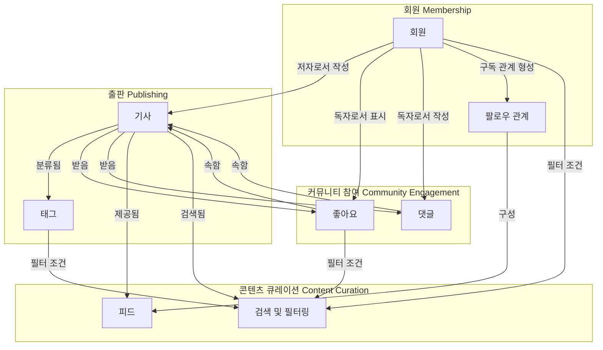

# 도메인 탐색 결과 (Domain Exploration)

## 시스템 개요

**RealWorld** - 소셜 블로깅 플랫폼

사용자들이 자신의 생각과 지식을 기사 형태로 발행하고, 다른 사용자들과 상호작용하는 온라인 커뮤니티 플랫폼입니다.

**핵심 비즈니스 가치**:
- 저자들이 콘텐츠를 작성하고 독자들과 소통할 수 있는 공간 제공
- 관심사 기반으로 콘텐츠를 발견하고 구독할 수 있는 개인화된 경험
- 커뮤니티 참여를 통한 지식 공유와 네트워킹

---

## 1. 바운디드 컨텍스트 (Bounded Contexts)

시스템을 구성하는 4개의 핵심 비즈니스 도메인을 식별했습니다.

---

### BC1: 회원 (Membership)
**비즈니스 목적**: 플랫폼 회원의 신원과 관계 관리

**도메인 언어**:
- **회원 (User)**: 플랫폼에 가입한 개인
- **프로필 (Profile)**: 회원의 공개 정보 (사용자명, 자기소개, 프로필 사진)
- **팔로우 (Follow)**: 다른 회원의 활동을 구독하는 행위
- **팔로워 (Follower)**: 나를 팔로우하는 회원
- **팔로잉 (Following)**: 내가 팔로우하는 회원

**핵심 비즈니스 규칙**:
- 사용자명과 이메일은 플랫폼 전체에서 유일해야 함
- 회원은 자신을 팔로우할 수 없음
- 팔로우 관계는 단방향 (A가 B를 팔로우해도 B가 A를 자동으로 팔로우하지 않음)

**주요 유스케이스**:
- 회원 가입 및 로그인
- 프로필 정보 수정
- 다른 회원 팔로우/언팔로우
- 프로필 조회

---

### BC2: 출판 (Publishing)
**비즈니스 목적**: 저자가 콘텐츠를 작성하고 발행하는 과정 관리

**도메인 언어**:
- **기사 (Article)**: 저자가 작성한 콘텐츠의 단위
- **저자 (Author)**: 기사를 작성한 회원
- **제목 (Title)**: 기사의 제목
- **슬러그 (Slug)**: URL에 사용되는 기사의 고유 식별자 (제목에서 자동 생성)
- **본문 (Body)**: 기사의 실제 내용
- **설명 (Description)**: 기사의 요약 또는 부제
- **태그 (Tag)**: 기사를 분류하는 키워드
- **발행 (Publish)**: 기사를 공개하는 행위
- **수정 (Update)**: 발행된 기사의 내용을 변경하는 행위

**핵심 비즈니스 규칙**:
- 슬러그는 제목으로부터 자동 생성됨 (소문자 변환, 특수문자 제거)
- 제목을 수정하면 슬러그도 함께 변경됨
- 기사는 여러 개의 태그를 가질 수 있으나 중복은 제거됨
- 기사 수정 시 수정 시각이 자동으로 기록됨
- 기사는 저자만 수정하거나 삭제할 수 있음

**주요 유스케이스**:
- 기사 작성 및 발행
- 기사 수정
- 기사 삭제
- 기사 조회

---

### BC3: 커뮤니티 참여 (Community Engagement)
**비즈니스 목적**: 독자와 저자 간의 상호작용 및 콘텐츠에 대한 반응 관리

**도메인 언어**:
- **좋아요 (Favorite)**: 독자가 기사에 표시하는 긍정적 반응
- **좋아요 수 (Favorites Count)**: 특정 기사가 받은 좋아요의 총 개수
- **댓글 (Comment)**: 기사에 대한 독자의 의견이나 질문
- **토론 (Discussion)**: 기사를 중심으로 이루어지는 댓글들의 집합

**핵심 비즈니스 규칙**:
- 회원은 동일한 기사에 한 번만 좋아요를 표시할 수 있음
- 좋아요는 언제든지 취소할 수 있음
- 댓글은 작성 후 수정할 수 없음 (불변)
- 댓글은 작성자 또는 기사 저자만 삭제할 수 있음
- 삭제된 기사의 댓글과 좋아요도 함께 삭제됨

**주요 유스케이스**:
- 기사에 좋아요 표시/취소
- 기사에 댓글 작성
- 댓글 삭제
- 기사의 댓글 목록 조회

---

### BC4: 콘텐츠 큐레이션 (Content Curation)
**비즈니스 목적**: 독자가 관심 있는 콘텐츠를 발견하고 소비하는 경험 제공

**도메인 언어**:
- **피드 (Feed)**: 팔로우한 저자들의 최신 기사 목록
- **태그 목록 (Tag List)**: 플랫폼에서 사용 중인 모든 태그
- **인기 태그 (Popular Tags)**: 많은 기사에서 사용되는 태그
- **필터링 (Filtering)**: 특정 조건으로 기사 목록을 좁히는 행위
  - 저자별 필터링: 특정 저자가 작성한 기사만 보기
  - 태그별 필터링: 특정 태그가 붙은 기사만 보기
  - 좋아요별 필터링: 특정 회원이 좋아요한 기사만 보기

**핵심 비즈니스 규칙**:
- 피드는 팔로우한 저자들의 기사만 포함함
- 피드는 최신 기사가 먼저 표시됨 (시간 역순)
- 필터는 조합 가능함 (예: 특정 태그 + 특정 저자)
- 페이지네이션은 커서 기반으로 동작함 (무한 스크롤 지원)

**주요 유스케이스**:
- 개인화된 피드 조회
- 태그별 기사 검색
- 저자별 기사 목록 조회
- 회원이 좋아요한 기사 목록 조회
- 인기 태그 목록 조회

---

## 2. 컨텍스트 맵 (Context Map)

각 바운디드 컨텍스트가 어떻게 협력하여 비즈니스 가치를 제공하는지 보여줍니다.

**컨텍스트 간 상호작용 설명**:

| 상류 컨텍스트 | 하류 컨텍스트 | 비즈니스 관계 | 설명 |
|---|---|---|---|
| 회원 | 출판 | 저자-콘텐츠 | 회원이 저자 역할로 기사를 작성하고 관리함 |
| 회원 | 커뮤니티 참여 | 독자-반응 | 회원이 독자 역할로 좋아요와 댓글을 남김 |
| 출판 | 커뮤니티 참여 | 콘텐츠-반응 | 기사가 좋아요와 댓글을 받음 |
| 출판 | 콘텐츠 큐레이션 | 콘텐츠-발견 | 발행된 기사가 검색과 피드에 노출됨 |
| 회원 | 콘텐츠 큐레이션 | 구독-피드 | 팔로우 관계가 개인화된 피드를 구성함 |
| 커뮤니티 참여 | 콘텐츠 큐레이션 | 반응-필터 | 좋아요 정보가 콘텐츠 필터링 조건으로 사용됨 |

---

## 3. 핵심 애그리게잇 (Core Aggregates)

각 바운디드 컨텍스트의 트랜잭션 경계와 비즈니스 불변식을 보장하는 핵심 엔티티입니다.

---

### BC1: 회원 (Membership)

#### Aggregate Root: **회원 (User)**

**비즈니스 정의**: 플랫폼에 가입하여 저자 또는 독자로 활동하는 개인

**핵심 정보**:
- 식별자 (id)
- 이메일 (email)
- 사용자명 (username)
- 비밀번호 (password)
- 자기소개 (bio)
- 프로필 사진 (image)

**불변식 (Invariants)**:
- 이메일은 플랫폼 전체에서 유일해야 함
- 사용자명은 플랫폼 전체에서 유일해야 함
- 회원 정보 수정 시 제공되지 않은 항목은 기존 값을 유지함

**생명주기**:
1. 회원 가입 시 생성됨
2. 회원이 프로필을 수정할 수 있음
3. 회원 탈퇴 시 삭제됨 (현재 미구현)

**관련 개념**:
- **팔로우 관계 (FollowRelation)**: 회원 간의 구독 관계를 나타내는 값 객체
  - 팔로우하는 회원 (userId)
  - 팔로우 대상 회원 (targetId)

---

### BC2: 출판 (Publishing)

#### Aggregate Root: **기사 (Article)**

**비즈니스 정의**: 저자가 작성하여 발행한 콘텐츠의 단위

**핵심 정보**:
- 식별자 (id)
- 슬러그 (slug) - URL에 사용되는 고유 식별자
- 제목 (title)
- 설명 (description)
- 본문 (body)
- 태그 목록 (tags)
- 저자 식별자 (userId)
- 발행 시각 (createdAt)
- 최종 수정 시각 (updatedAt)

**불변식 (Invariants)**:
- 슬러그는 제목으로부터 자동 생성됨 (소문자 변환, 특수문자를 하이픈으로 치환)
- 제목을 수정하면 슬러그도 자동으로 변경됨
- 태그 목록에는 중복이 없음
- 내용을 수정하면 수정 시각이 자동으로 갱신됨

**생명주기**:
1. 저자가 기사를 작성하여 발행함
2. 저자가 기사를 수정할 수 있음
3. 저자가 기사를 삭제할 수 있음

**관련 개념**:
- **태그 (Tag)**: 기사를 분류하는 키워드 (값 객체)
  - 태그명 (name)

---

### BC3: 커뮤니티 참여 (Community Engagement)

#### Aggregate Root 1: **좋아요 (ArticleFavorite)**

**비즈니스 정의**: 독자가 기사에 표시한 긍정적 반응

**핵심 정보**:
- 기사 식별자 (articleId)
- 회원 식별자 (userId)

**불변식 (Invariants)**:
- 동일한 회원이 동일한 기사에 중복으로 좋아요를 표시할 수 없음
- 좋아요는 언제든지 취소할 수 있음 (삭제)

**생명주기**:
1. 독자가 기사에 좋아요를 표시함
2. 독자가 좋아요를 취소함 (삭제)

---

#### Aggregate Root 2: **댓글 (Comment)**

**비즈니스 정의**: 독자가 기사에 남긴 의견이나 질문

**핵심 정보**:
- 식별자 (id)
- 댓글 내용 (body)
- 작성자 식별자 (userId)
- 기사 식별자 (articleId)
- 작성 시각 (createdAt)

**불변식 (Invariants)**:
- 댓글은 작성 후 수정할 수 없음 (불변)
- 댓글은 작성자 또는 기사 저자만 삭제할 수 있음

**생명주기**:
1. 독자가 기사에 댓글을 작성함
2. 작성자 또는 기사 저자가 댓글을 삭제함

---

### BC4: 콘텐츠 큐레이션 (Content Curation)

**특징**: 이 컨텍스트는 독립적인 Aggregate Root를 갖지 않습니다. 다른 컨텍스트의 데이터를 조합하여 독자에게 최적화된 뷰를 제공하는 읽기 전용 모델입니다.

**주요 읽기 모델**:
- **피드 (Feed)**: 팔로우한 저자들의 최신 기사 목록
- **기사 목록 (Article List)**: 필터링 및 페이지네이션된 기사 목록
- **태그 목록 (Tag List)**: 플랫폼에서 사용 중인 모든 태그
- **프로필 뷰 (Profile View)**: 회원의 공개 정보와 활동 통계

**데이터 소스**:
- 회원 컨텍스트의 팔로우 관계
- 출판 컨텍스트의 기사와 태그
- 커뮤니티 참여 컨텍스트의 좋아요 수

---

## 4. 유비쿼터스 언어 (Ubiquitous Language)

팀 전체가 공유하는 핵심 용어 정의입니다.

| 용어 | 정의 | 동의어/관련 용어 |
|---|---|---|
| **회원 (User)** | 플랫폼에 가입한 개인 | 사용자, Member |
| **저자 (Author)** | 기사를 작성하는 회원 | Writer, Publisher |
| **독자 (Reader)** | 기사를 읽고 반응하는 회원 | Viewer, Consumer |
| **기사 (Article)** | 저자가 작성한 콘텐츠 | Post, Content |
| **슬러그 (Slug)** | URL에 사용되는 기사의 고유 식별자 | URL Identifier |
| **태그 (Tag)** | 기사를 분류하는 키워드 | Category, Label |
| **좋아요 (Favorite)** | 기사에 대한 긍정적 반응 | Like, Heart |
| **댓글 (Comment)** | 기사에 대한 의견이나 질문 | Reply, Feedback |
| **팔로우 (Follow)** | 다른 회원의 활동을 구독하는 행위 | Subscribe |
| **팔로워 (Follower)** | 나를 팔로우하는 회원 | Subscriber |
| **팔로잉 (Following)** | 내가 팔로우하는 회원 | Subscription |
| **피드 (Feed)** | 팔로우한 저자들의 최신 기사 목록 | Timeline, Stream |
| **프로필 (Profile)** | 회원의 공개 정보 | Public Info |
| **발행 (Publish)** | 기사를 공개하는 행위 | Post, Release |
| **토론 (Discussion)** | 기사를 중심으로 이루어지는 댓글들의 집합 | Conversation, Thread |

---

## 5. 비즈니스 규칙 요약

### 회원 관련
- 이메일과 사용자명은 플랫폼 전체에서 유일해야 함
- 회원은 자신을 팔로우할 수 없음
- 팔로우 관계는 단방향임

### 기사 관련
- 슬러그는 제목으로부터 자동 생성됨
- 제목 수정 시 슬러그도 변경됨
- 기사는 저자만 수정하거나 삭제할 수 있음
- 태그는 중복 없이 저장됨

### 좋아요 관련
- 회원은 동일한 기사에 한 번만 좋아요를 표시할 수 있음
- 좋아요는 언제든지 취소 가능함

### 댓글 관련
- 댓글은 작성 후 수정할 수 없음
- 댓글은 작성자 또는 기사 저자만 삭제할 수 있음

### 피드 관련
- 피드는 팔로우한 저자들의 기사만 포함함
- 피드는 최신 기사가 먼저 표시됨

---

## 6. 주요 발견 사항

### 도메인 모델의 강점
1. **명확한 책임 분리**: 각 바운디드 컨텍스트가 독립적인 비즈니스 영역을 담당함
2. **불변성 원칙**: 댓글과 좋아요는 수정 불가능하여 데이터 무결성 보장
3. **자동화된 규칙**: 슬러그 생성, 수정 시각 갱신 등이 자동으로 처리됨
4. **유연한 검색**: 다양한 필터 조합으로 콘텐츠 발견 지원

### 개선 기회
1. **댓글의 소속**: 댓글이 기사의 일부인지 독립적인 개념인지 명확히 할 필요
2. **태그 관리**: 태그가 기사에 종속되어 있어 태그 중심 기능 확장이 어려움
3. **이벤트 부재**: 컨텍스트 간 느슨한 결합을 위한 도메인 이벤트 미사용
4. **회원 탈퇴**: 회원 탈퇴 시나리오가 구현되지 않음

---

## 다음 단계

다음 분석 단계에서는 각 컨텍스트의 핵심 비즈니스 로직을 상세히 분석합니다:

1. **비즈니스 로직 분석**: 주요 유스케이스의 비즈니스 규칙을 결정 테이블로 정리
2. **프로세스 흐름 시각화**: 사용자 여정 기반 엔드투엔드 비즈니스 프로세스 작성
