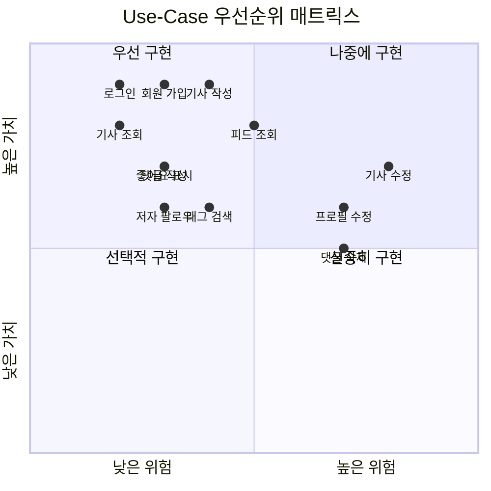

# Use-Case Model

## 개요

이 문서는 Unified Process의 모범사례에 따라 RealWorld 플랫폼의 Use-Case Model을 정의합니다. 각 Use-Case는 시스템이 제공하는 비즈니스 가치를 액터(Actor)의 관점에서 기술하며, 도메인(바운디드 컨텍스트)별로 그룹화되어 있습니다.

---

## 액터 (Actors)

### 주요 액터 (Primary Actors)

| 액터 | 설명 | 역할 |
|------|------|------|
| **독자 (Reader)** | 플랫폼을 방문하여 콘텐츠를 소비하는 회원 | 기사 읽기, 검색, 좋아요, 댓글 작성 |
| **저자 (Author)** | 콘텐츠를 작성하고 발행하는 회원 | 기사 작성, 수정, 삭제, 커뮤니티 관리 |
| **방문자 (Visitor)** | 로그인하지 않은 익명 사용자 | 기사 조회, 회원 가입 |

### 보조 액터 (Secondary Actors)

| 액터 | 설명 | 역할 |
|------|------|------|
| **시스템 (System)** | 자동화된 백그라운드 프로세스 | 슬러그 생성, 피드 갱신, 통계 집계 |

**참고**: 현재 시스템에는 관리자(Administrator) 역할이 구현되어 있지 않습니다.

---

## Use-Case 다이어그램

### 전체 시스템 Use-Case 다이어그램

```mermaid
graph TB
    subgraph Actors
        Visitor[방문자<br/>Visitor]
        Reader[독자<br/>Reader]
        Author[저자<br/>Author]
    end
    
    subgraph BC1[회원 컨텍스트]
        UC1[UC-M1: 회원 가입]
        UC2[UC-M2: 로그인]
        UC3[UC-M3: 프로필 수정]
        UC4[UC-M4: 프로필 조회]
        UC5[UC-M5: 저자 팔로우]
        UC6[UC-M6: 저자 언팔로우]
    end
    
    subgraph BC2[출판 컨텍스트]
        UC7[UC-P1: 기사 작성]
        UC8[UC-P2: 기사 수정]
        UC9[UC-P3: 기사 삭제]
        UC10[UC-P4: 기사 조회]
    end
    
    subgraph BC3[커뮤니티 참여 컨텍스트]
        UC11[UC-E1: 좋아요 표시]
        UC12[UC-E2: 좋아요 취소]
        UC13[UC-E3: 댓글 작성]
        UC14[UC-E4: 댓글 삭제]
    end
    
    subgraph BC4[콘텐츠 큐레이션 컨텍스트]
        UC15[UC-C1: 피드 조회]
        UC16[UC-C2: 태그로 검색]
        UC17[UC-C3: 저자로 검색]
        UC18[UC-C4: 인기 태그 조회]
    end
    
    Visitor --> UC1
    Visitor --> UC10
    
    Reader --> UC2
    Reader --> UC3
    Reader --> UC4
    Reader --> UC5
    Reader --> UC6
    Reader --> UC10
    Reader --> UC11
    Reader --> UC12
    Reader --> UC13
    Reader --> UC15
    Reader --> UC16
    Reader --> UC17
    Reader --> UC18
    
    Author --> UC7
    Author --> UC8
    Author --> UC9
    Author --> UC14
    
    UC7 -.includes.-> UC2
    UC8 -.includes.-> UC2
    UC9 -.includes.-> UC2
    UC11 -.includes.-> UC2
    UC12 -.includes.-> UC2
    UC13 -.includes.-> UC2
    UC14 -.includes.-> UC2
    UC15 -.includes.-> UC2
```

---

## Use-Case 목록

### 회원 컨텍스트 (Membership Context)

| Use-Case ID | Use-Case 명 | 주요 액터 | 우선순위 | 복잡도 |
|-------------|------------|----------|---------|--------|
| UC-M1 | 회원 가입 | 방문자 | 높음 | 중간 |
| UC-M2 | 로그인 | 방문자 | 높음 | 낮음 |
| UC-M3 | 프로필 수정 | 독자/저자 | 중간 | 높음 |
| UC-M4 | 프로필 조회 | 독자/저자 | 중간 | 낮음 |
| UC-M5 | 저자 팔로우 | 독자 | 높음 | 낮음 |
| UC-M6 | 저자 언팔로우 | 독자 | 중간 | 낮음 |

### 출판 컨텍스트 (Publishing Context)

| Use-Case ID | Use-Case 명 | 주요 액터 | 우선순위 | 복잡도 |
|-------------|------------|----------|---------|--------|
| UC-P1 | 기사 작성 | 저자 | 높음 | 중간 |
| UC-P2 | 기사 수정 | 저자 | 높음 | 높음 |
| UC-P3 | 기사 삭제 | 저자 | 중간 | 중간 |
| UC-P4 | 기사 조회 | 방문자/독자/저자 | 높음 | 낮음 |

### 커뮤니티 참여 컨텍스트 (Community Engagement Context)

| Use-Case ID | Use-Case 명 | 주요 액터 | 우선순위 | 복잡도 |
|-------------|------------|----------|---------|--------|
| UC-E1 | 좋아요 표시 | 독자 | 높음 | 낮음 |
| UC-E2 | 좋아요 취소 | 독자 | 중간 | 낮음 |
| UC-E3 | 댓글 작성 | 독자 | 높음 | 낮음 |
| UC-E4 | 댓글 삭제 | 독자/저자 | 중간 | 높음 |

### 콘텐츠 큐레이션 컨텍스트 (Content Curation Context)

| Use-Case ID | Use-Case 명 | 주요 액터 | 우선순위 | 복잡도 |
|-------------|------------|----------|---------|--------|
| UC-C1 | 피드 조회 | 독자 | 높음 | 중간 |
| UC-C2 | 태그로 검색 | 독자 | 높음 | 낮음 |
| UC-C3 | 저자로 검색 | 독자 | 중간 | 낮음 |
| UC-C4 | 인기 태그 조회 | 독자 | 낮음 | 낮음 |

---

## Use-Case 관계

### Include 관계
- 대부분의 Use-Case는 **UC-M2 (로그인)**을 포함합니다
- 인증이 필요한 모든 작업은 로그인을 전제로 합니다

### Extend 관계
- **UC-P2 (기사 수정)** extends **UC-P4 (기사 조회)**: 기사를 조회한 후 수정할 수 있음
- **UC-E3 (댓글 작성)** extends **UC-P4 (기사 조회)**: 기사를 읽은 후 댓글을 작성할 수 있음
- **UC-E1 (좋아요 표시)** extends **UC-P4 (기사 조회)**: 기사를 읽은 후 좋아요를 표시할 수 있음

### Generalization 관계
- **독자**와 **저자**는 모두 **회원**의 특수화입니다
- 저자는 독자의 모든 기능을 수행할 수 있으며, 추가로 콘텐츠 발행 기능을 가집니다

---

## Use-Case 우선순위 매트릭스

### 비즈니스 가치 vs 기술적 위험

**우선순위 1 (즉시 구현)**: 회원 가입, 로그인, 기사 작성, 기사 조회
**우선순위 2 (조기 구현)**: 피드 조회, 좋아요, 댓글, 팔로우
**우선순위 3 (후기 구현)**: 프로필 수정, 기사 수정, 댓글 삭제

---

## 다음 섹션

각 Use-Case의 상세 명세는 다음 섹션에서 도메인별로 그룹화하여 제공됩니다:

1. [회원 컨텍스트 Use-Case Specifications](#회원-컨텍스트-use-case-specifications)
2. [출판 컨텍스트 Use-Case Specifications](#출판-컨텍스트-use-case-specifications)
3. [커뮤니티 참여 컨텍스트 Use-Case Specifications](#커뮤니티-참여-컨텍스트-use-case-specifications)
4. [콘텐츠 큐레이션 컨텍스트 Use-Case Specifications](#콘텐츠-큐레이션-컨텍스트-use-case-specifications)
