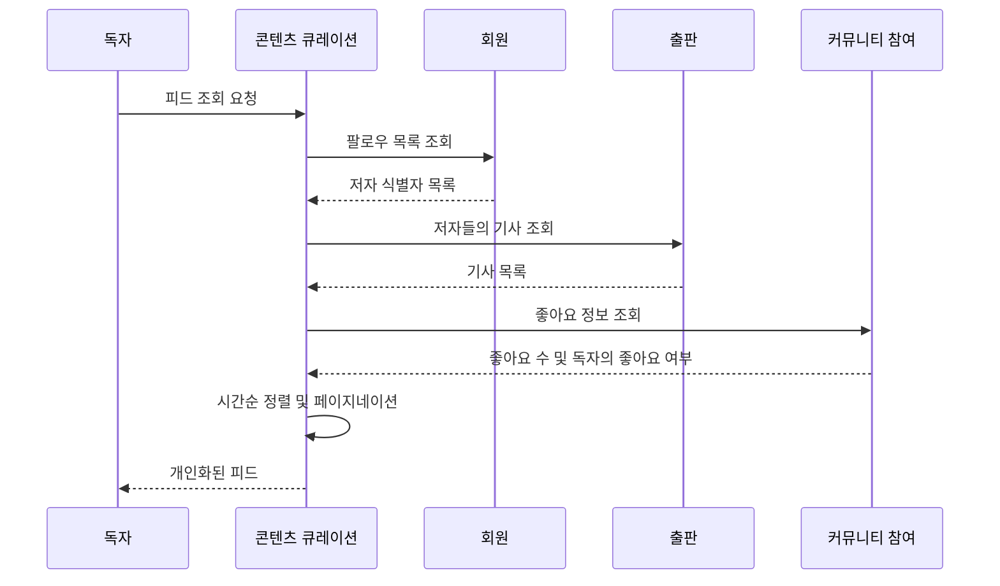
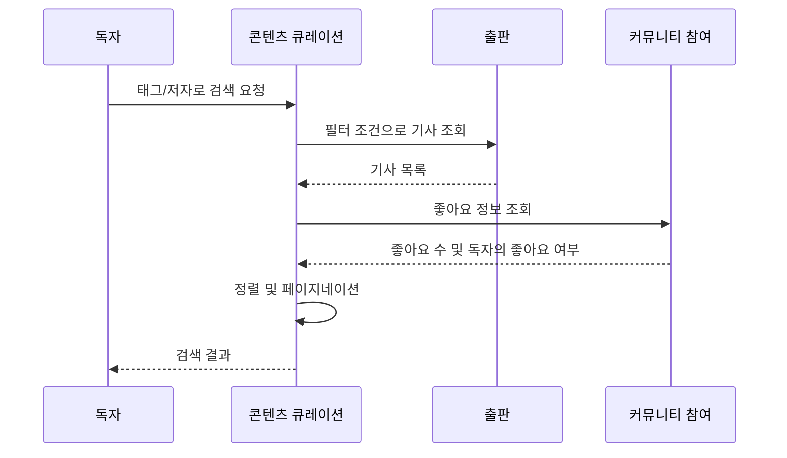

# Use-Case Specifications - 콘텐츠 큐레이션 컨텍스트

## 개요

이 문서는 콘텐츠 큐레이션(Content Curation) 컨텍스트의 Use-Case 상세 명세를 Unified Process 표준에 따라 작성합니다.

---

## UC-C1: 피드 조회

### Brief Description
독자가 팔로우한 저자들의 최신 기사를 시간순으로 조회하는 과정

### Actors
- **Primary**: 독자 (Reader)
- **Secondary**: 시스템 (System)

### Preconditions
- 독자가 로그인되어 있어야 함

### Postconditions
- **Success**: 개인화된 피드가 표시됨
- **Failure**: 조회 실패, 오류 메시지 표시

### Basic Flow
1. 독자가 피드 페이지에 접근한다
2. 시스템이 독자가 팔로우 중인 저자 목록을 조회한다
3. 시스템이 팔로우 중인 저자가 있는지 확인한다
4. 시스템이 해당 저자들의 기사를 조회한다
5. 시스템이 기사를 발행 시각 기준 최신순으로 정렬한다
6. 시스템이 페이지네이션을 적용한다 (커서 기반)
7. 시스템이 각 기사의 상세 정보를 조회한다:
   - 저자 정보
   - 좋아요 수
   - 독자의 좋아요 여부
8. 시스템이 피드를 반환한다
9. Use-Case 종료

### Alternative Flows

#### AF1: 팔로우 중인 저자가 없음
- **Trigger**: Step 3에서 팔로우 중인 저자가 없는 경우
- **Flow**:
  1. 시스템이 빈 피드를 반환한다
  2. 시스템이 "팔로우할 저자를 찾아보세요" 안내 메시지를 표시한다
  3. Use-Case 종료

#### AF2: 팔로우 중인 저자의 기사가 없음
- **Trigger**: Step 4에서 조회된 기사가 없는 경우
- **Flow**:
  1. 시스템이 빈 피드를 반환한다
  2. 시스템이 "아직 새로운 기사가 없습니다" 안내 메시지를 표시한다
  3. Use-Case 종료

#### AF3: 다음 페이지 요청
- **Trigger**: 독자가 스크롤하여 다음 페이지를 요청하는 경우
- **Flow**:
  1. 시스템이 마지막 기사의 커서를 기준으로 다음 페이지를 조회한다
  2. Step 5부터 Basic Flow를 계속 진행한다

#### AF4: 이전 페이지 요청
- **Trigger**: 독자가 이전 페이지를 요청하는 경우
- **Flow**:
  1. 시스템이 첫 번째 기사의 커서를 기준으로 이전 페이지를 조회한다
  2. Step 5부터 Basic Flow를 계속 진행한다

### Business Rules
- **BR-C1.1**: 피드는 팔로우한 저자들의 기사만 포함함
- **BR-C1.2**: 기사는 발행 시각 기준 최신순으로 정렬됨
- **BR-C1.3**: 페이지네이션은 커서 기반으로 동작함 (무한 스크롤 지원)
- **BR-C1.4**: 각 기사에 좋아요 수와 독자의 좋아요 여부가 표시됨

### Special Requirements
- **SR-C1.1**: 피드는 실시간으로 업데이트되지 않음 (새로고침 필요)
- **SR-C1.2**: 커서 기반 페이지네이션으로 대량의 기사를 효율적으로 처리함

### Related Use Cases
- **Includes**: UC-M2 (로그인)
- **Related**: UC-M5 (저자 팔로우), UC-P1 (기사 작성)

### Notes
- **프로세스 참조**: business-process-flows.md의 "프로세스 6: 개인화된 피드 생성"

---

## UC-C2: 태그로 검색

### Brief Description
독자가 특정 태그가 붙은 기사들을 검색하는 과정

### Actors
- **Primary**: 독자 (Reader)
- **Secondary**: 시스템 (System)

### Preconditions
- 검색하려는 태그가 존재해야 함

### Postconditions
- **Success**: 태그가 붙은 기사 목록이 표시됨
- **Failure**: 검색 실패, 오류 메시지 표시

### Basic Flow
1. 독자가 특정 태그를 선택하거나 입력한다
2. 시스템이 해당 태그가 붙은 기사를 조회한다
3. 시스템이 기사를 발행 시각 기준 최신순으로 정렬한다
4. 시스템이 페이지네이션을 적용한다
5. 시스템이 각 기사의 상세 정보를 조회한다:
   - 저자 정보
   - 좋아요 수
   - 독자의 좋아요 여부 (로그인한 경우)
6. 시스템이 검색 결과를 반환한다
7. Use-Case 종료

### Alternative Flows

#### AF1: 해당 태그의 기사가 없음
- **Trigger**: Step 2에서 조회된 기사가 없는 경우
- **Flow**:
  1. 시스템이 빈 목록을 반환한다
  2. 시스템이 "해당 태그의 기사가 없습니다" 안내 메시지를 표시한다
  3. Use-Case 종료

#### AF2: 비로그인 상태에서 검색
- **Trigger**: 독자가 로그인하지 않은 경우
- **Flow**:
  1. Step 5에서 좋아요 여부를 false로 설정한다
  2. Basic Flow를 계속 진행한다

### Business Rules
- **BR-C2.1**: 태그 검색은 로그인 없이도 가능함
- **BR-C2.2**: 기사는 발행 시각 기준 최신순으로 정렬됨
- **BR-C2.3**: 하나의 기사가 여러 태그를 가질 수 있음

### Special Requirements
- 없음

### Related Use Cases
- **Related**: UC-C4 (인기 태그 조회), UC-P1 (기사 작성)

### Notes
- **프로세스 참조**: business-process-flows.md의 "프로세스 2: 독자의 기사 소비 및 반응 여정"

---

## UC-C3: 저자로 검색

### Brief Description
독자가 특정 저자가 작성한 기사들을 검색하는 과정

### Actors
- **Primary**: 독자 (Reader)
- **Secondary**: 시스템 (System)

### Preconditions
- 검색하려는 저자가 존재해야 함

### Postconditions
- **Success**: 저자의 기사 목록이 표시됨
- **Failure**: 검색 실패, 오류 메시지 표시

### Basic Flow
1. 독자가 특정 저자의 사용자명을 입력한다
2. 시스템이 사용자명으로 저자를 조회한다
3. 시스템이 해당 저자가 작성한 기사를 조회한다
4. 시스템이 기사를 발행 시각 기준 최신순으로 정렬한다
5. 시스템이 페이지네이션을 적용한다
6. 시스템이 각 기사의 상세 정보를 조회한다:
   - 좋아요 수
   - 독자의 좋아요 여부 (로그인한 경우)
7. 시스템이 검색 결과를 반환한다
8. Use-Case 종료

### Alternative Flows

#### AF1: 저자가 존재하지 않음
- **Trigger**: Step 2에서 저자를 찾을 수 없는 경우
- **Flow**:
  1. 시스템이 "저자를 찾을 수 없습니다" 오류 메시지를 표시한다
  2. Use-Case 종료

#### AF2: 저자의 기사가 없음
- **Trigger**: Step 3에서 조회된 기사가 없는 경우
- **Flow**:
  1. 시스템이 빈 목록을 반환한다
  2. 시스템이 "아직 작성한 기사가 없습니다" 안내 메시지를 표시한다
  3. Use-Case 종료

#### AF3: 비로그인 상태에서 검색
- **Trigger**: 독자가 로그인하지 않은 경우
- **Flow**:
  1. Step 6에서 좋아요 여부를 false로 설정한다
  2. Basic Flow를 계속 진행한다

### Business Rules
- **BR-C3.1**: 저자 검색은 로그인 없이도 가능함
- **BR-C3.2**: 기사는 발행 시각 기준 최신순으로 정렬됨

### Special Requirements
- 없음

### Related Use Cases
- **Related**: UC-M4 (프로필 조회), UC-P1 (기사 작성)

---

## UC-C4: 인기 태그 조회

### Brief Description
독자가 플랫폼에서 많이 사용되는 인기 태그 목록을 조회하는 과정

### Actors
- **Primary**: 독자 (Reader)
- **Secondary**: 시스템 (System)

### Preconditions
- 없음

### Postconditions
- **Success**: 인기 태그 목록이 표시됨
- **Failure**: 조회 실패, 오류 메시지 표시

### Basic Flow
1. 독자가 플랫폼 메인 페이지에 접근한다
2. 시스템이 모든 태그를 조회한다
3. 시스템이 각 태그의 사용 빈도를 집계한다
4. 시스템이 태그를 사용 빈도 기준 내림차순으로 정렬한다
5. 시스템이 상위 N개의 태그를 선택한다 (예: 상위 10개)
6. 시스템이 인기 태그 목록을 반환한다
7. Use-Case 종료

### Alternative Flows

#### AF1: 태그가 없음
- **Trigger**: Step 2에서 조회된 태그가 없는 경우
- **Flow**:
  1. 시스템이 빈 목록을 반환한다
  2. Use-Case 종료

### Business Rules
- **BR-C4.1**: 인기 태그는 로그인 없이도 조회 가능함
- **BR-C4.2**: 인기 태그는 사용 빈도 기준으로 정렬됨
- **BR-C4.3**: 표시되는 태그 개수는 시스템에서 정의함

### Special Requirements
- **SR-C4.1**: 인기 태그는 캐싱되어 성능을 최적화할 수 있음

### Related Use Cases
- **Related**: UC-C2 (태그로 검색), UC-P1 (기사 작성)

---

## 추가 Use-Case (현재 미구현)

### UC-C5: 좋아요한 기사 조회 (구현됨, 문서화 필요)

**Brief Description**: 독자가 특정 회원이 좋아요한 기사 목록을 조회하는 과정

**Actors**: 독자 (Reader)

**Preconditions**: 
- 조회하려는 회원이 존재해야 함

**Basic Flow**:
1. 독자가 특정 회원의 프로필에서 "좋아요한 기사" 탭을 선택한다
2. 시스템이 해당 회원이 좋아요한 기사를 조회한다
3. 시스템이 기사를 좋아요 표시 시각 기준 최신순으로 정렬한다
4. 시스템이 페이지네이션을 적용한다
5. 시스템이 기사 목록을 반환한다

**Business Rules**:
- 좋아요한 기사 목록은 공개되어 있어 누구나 조회 가능함

---

## 컨텍스트 간 협력

### 피드 생성 프로세스

### 검색 프로세스

---

## 성능 고려사항

### 피드 조회 최적화
- **문제**: 팔로우한 저자가 많을 경우 조회 성능 저하
- **해결책**: 
  - 피드 사전 생성 (Pre-computed Feed)
  - 캐싱 전략 적용
  - 페이지네이션 크기 제한

### 태그 검색 최적화
- **문제**: 인기 태그의 기사가 많을 경우 조회 성능 저하
- **해결책**:
  - 태그별 인덱스 생성
  - 검색 결과 캐싱
  - 페이지네이션 적용

### 인기 태그 조회 최적화
- **문제**: 모든 태그를 집계하는 비용이 높음
- **해결책**:
  - 인기 태그 목록 캐싱 (주기적 갱신)
  - 증분 집계 (Incremental Aggregation)
